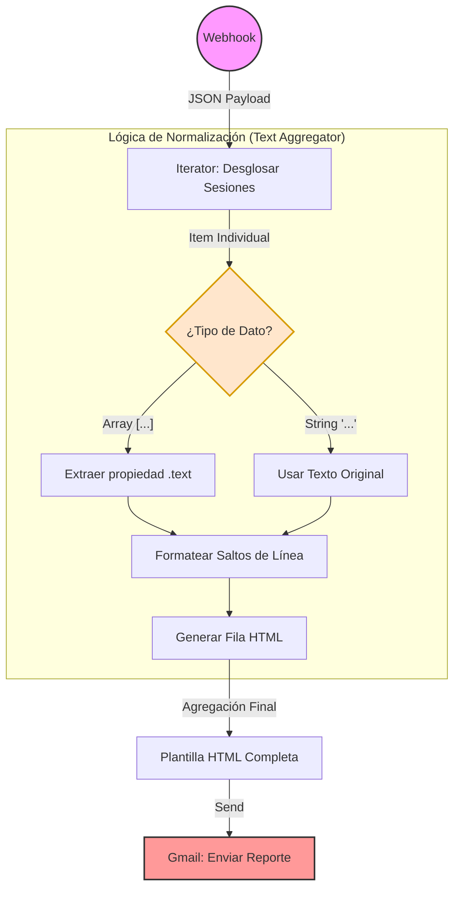

# Mentor IA - Sistema de Aprendizaje Inteligente

[](https://nextjs.org/)
[](https://fastapi.tiangolo.com/)
[](https://qdrant.tech/)
[](https://ai.google.dev/)
[](LICENSE)

Un sistema multiagente de IA diseñado para apoyar el aprendizaje mediante Retrieval-Augmented Generation (RAG), planes de estudio personalizados y procesamiento inteligente de documentos.

## 📋 Tabla de Contenidos

- [Características](#-características)
- [Arquitectura](#-arquitectura)
- [Tecnologías](#-tecnologías)
- [Instalación](#-instalación)
- [Configuración](#-configuración)
- [Ejecución](#-ejecución)
- [Uso](#-uso)
- [API](#-api)
- [Despliegue](#-despliegue)
- [Contribución](#-contribución)
- [Licencia](#-licencia)

## ✨ Características

### 🤖 Asistente de Estudio Inteligente
- **Consultas RAG**: Responde preguntas basadas en documentos indexados
- **Múltiples formatos**: Soporta PDFs, imágenes, archivos de texto (TXT, MD)
- **Búsqueda semántica**: Utiliza embeddings de Google Gemini para búsqueda precisa

### 📚 Gestión de Documentos
- **Indexación automática**: Procesa y almacena documentos en Qdrant
- **OCR integrado**: Extrae texto de imágenes usando Google Vision AI
- **Visualización**: Interfaz para explorar documentos indexados

### 📅 Planes de Estudio Personalizados
- **Repaso espaciado**: Genera planes basados en la técnica de repetición espaciada
- **Envío automático**: Envía planes por email usando Make.com
- **Personalización**: Ajusta fechas y contenido según necesidades

### 🎨 Interfaz Moderna
- **Responsive**: Funciona en desktop, tablet y móvil
- **Accesible**: Diseño inclusivo con componentes shadcn/ui
- **Intuitiva**: Tres pestañas principales: Contexto, Documentos, OCR

## 🏗️ Arquitectura

```
┌─────────────────┐    ┌─────────────────┐    ┌─────────────────┐
│   Frontend      │    │   Backend       │    │   Base de       │
│   (Next.js)     │◄──►│   (FastAPI)     │◄──►│   Datos         │
│                 │    │                 │    │   (Qdrant)      │
│ • React/TSX     │    │ • Python        │    │                 │
│ • Tailwind CSS  │    │ • Agentes IA    │    │ • Embeddings    │
│ • shadcn/ui     │    │ • OCR           │    │ • Búsqueda vec. │
└─────────────────┘    └─────────────────┘    └─────────────────┘
         │                       │                       │
         └───────────────────────┼───────────────────────┘
                                 │
                    ┌─────────────────┐
                    │   Servicios     │
                    │   Externos      │
                    │                 │
                    │ • Google Gemini │
                    │ • Google Vision │
                    │ • Make.com      │
                    └─────────────────┘
```

## 🛠️ Tecnologías

### Backend
- **FastAPI**: Framework web moderno para APIs REST
- **Qdrant**: Base de datos vectorial para embeddings
- **Google Gemini**: Modelo de lenguaje para generación de texto
- **Google Vision AI**: OCR y análisis de imágenes
- **Python**: Lenguaje de programación principal

### Frontend
- **Next.js 15**: Framework React con App Router
- **TypeScript**: JavaScript tipado para mayor robustez
- **Tailwind CSS**: Framework CSS utilitario
- **shadcn/ui**: Componentes UI accesibles y modernos
- **Lucide React**: Iconos vectoriales

### Infraestructura
- **Make.com**: Automatización de workflows (envío de emails)
- **Docker**: Contenedorización (opcional)
- **Vercel**: Despliegue del frontend

## 🚀 Instalación

### Prerrequisitos

- **Python 3.9+**
- **Node.js 18+**
- **npm o yarn**
- **Cuenta de Google Cloud** (para Gemini y Vision AI)
- **Cuenta de Qdrant Cloud** (o instancia local)
- **Cuenta de Make.com** (opcional, para envío de emails)

### 1. Clonar el repositorio

```bash
git clone https://github.com/tu-usuario/proyecto-ia-basico.git
cd proyecto-ia-basico
```

### 2. Configurar el Backend

```bash
# Navegar al directorio del backend
cd mentor-ia-aprendizaje

# Crear entorno virtual
python -m venv .venv
source .venv/bin/activate  # En Windows: .venv\Scripts\activate

# Instalar dependencias
pip install -r requirements.txt
```

### 3. Configurar el Frontend

```bash
# Navegar al directorio del frontend
cd ../mentor-ia-frontend

# Instalar dependencias
npm install
```

## ⚙️ Configuración

### Variables de Entorno del Backend

Crear el archivo `mentor-ia-aprendizaje/.env` con:

```env
# Clave de Gemini (Google AI Studio)
GOOGLE_API_KEY=tu_clave_de_gemini_aqui

# Configuración de Qdrant Cloud
QDRANT_URL=https://tu-url-de-qdrant.cloud.qdrant.io:6333
QDRANT_API_KEY=tu_api_key_de_qdrant
QDRANT_COLLECTION=mentor_ia_aprendizaje

# Google Vision Cloud API
GOOGLE_APPLICATION_CREDENTIALS=/ruta/a/tu/credenciales.json

# Make.com webhook (opcional)
MAKE_WEBHOOK_URL=https://hook.us2.make.com/tu-webhook-id
```

### Variables de Entorno del Frontend

Crear el archivo `mentor-ia-frontend/.env.local` con:

```env
# URL del backend
NEXT_PUBLIC_BACKEND_URL=http://127.0.0.1:8000
```

### Configuración de APIs Externas

#### Google Cloud
1. Crear un proyecto en [Google Cloud Console](https://console.cloud.google.com/)
2. Habilitar las APIs: Gemini AI API y Vision AI API
3. Crear credenciales y descargar el archivo JSON
4. Configurar la variable `GOOGLE_APPLICATION_CREDENTIALS`

#### Qdrant
1. Crear cuenta en [Qdrant Cloud](https://cloud.qdrant.io/)
2. Crear un cluster
3. Obtener URL y API key
4. Configurar las variables de Qdrant

#### Make.com (Opcional)
1. Crear cuenta en [Make.com](https://www.make.com/)
2. Crear un scenario con webhook trigger
3. Configurar envío de email
4. Copiar la URL del webhook

## ▶️ Ejecución

### Modo Desarrollo

#### Backend
```bash
cd mentor-ia-aprendizaje
source .venv/bin/activate
python -m uvicorn src.app:app --host 0.0.0.0 --port 8000 --reload
```

#### Frontend
```bash
cd mentor-ia-frontend
npm run dev
```

Acceder a:
- **Frontend**: http://localhost:3000
- **Backend API**: http://localhost:8000
- **Documentación API**: http://localhost:8000/docs

### Modo Producción

#### Backend
```bash
cd mentor-ia-aprendizaje
source .venv/bin/activate
python -m uvicorn src.app:app --host 0.0.0.0 --port 8000
```

#### Frontend
```bash
cd mentor-ia-frontend
npm run build
npm start
```

## 📖 Uso

### 1. Indexar Documentos

1. Ir a la pestaña **"Contexto"**
2. Hacer clic en **"Subir Documento"**
3. Seleccionar archivos (PDF, TXT, MD, imágenes)
4. El sistema procesará automáticamente los documentos

### 2. Consultar Información

1. En la pestaña **"Contexto"**
2. Escribir una pregunta en el campo de texto
3. Presionar Enter o hacer clic en el botón de envío
4. El sistema buscará información relevante y responderá

### 3. Generar Plan de Estudio

1. Ir a la pestaña **"Plan de Repaso"**
2. Ingresar el tema de estudio
3. Opcional: Seleccionar fecha de inicio
4. Opcional: Ingresar email para envío automático
5. Hacer clic en **"Generar Plan de Repaso"**

### 4. Extraer Texto de Imágenes

1. Ir a la pestaña **"OCR"**
2. Hacer clic en **"Subir Imagen"**
3. Seleccionar imagen (PNG, JPG, JPEG)
4. El texto extraído aparecerá automáticamente

### 5. Explorar Documentos Indexados

1. Ir a la pestaña **"Documentos"**
2. Ver la lista de documentos procesados
3. Explorar estadísticas de chunks y tipos de archivo

### 6. Módulo de Automatización de Notificaciones (Make.com)

Este módulo gestiona la recepción, procesamiento y distribución de planes de estudio personalizados vía correo electrónico. El flujo transforma una estructura JSON compleja y anidada en un reporte HTML responsive y legible.

## 🔄 Arquitectura del Flujo

## 📊 Diagrama del Flujo de Datos



El escenario en Make consta de 4 etapas críticas:

1.  **Ingesta de Datos (Webhook):** Recibe un payload JSON con información jerárquica (Datos del usuario -> Lista de Fuentes -> Lista de Sesiones).
2.  **Desglose de Iteraciones (Iterator):** Separa el array `sesiones[]` para procesar cada fecha y actividad de manera individual.
3.  **Normalización y Agregación (Text Aggregator):**
    * Construye dinámicamente las filas (`<tr>`) de la tabla HTML.
    * **Manejo de Excepciones:** Implementa lógica avanzada para normalizar datos inconsistentes en el campo `descripcion` (ver *Detalle Técnico*).
4.  **Entrega (Gmail):** Ensambla el HTML base con las filas agregadas y envía el correo final al usuario.

## 🛠️ Solución Técnica: Manejo de Datos Polimórficos

Uno de los desafíos principales de esta integración fue la inconsistencia en el tipo de dato del campo `descripcion` proveniente del origen:

* **Caso A:** Array de objetos (`[{ type: 'text', text: '...' }]`).
* **Caso B:** String plano (`"Texto directo..."`).

Se implementó una fórmula robusta en el **Text Aggregator** para estandarizar la entrada antes del renderizado, evitando errores de tipo `Invalid Array` o `RuntimeError`.

**Lógica Implementada (Pseudocódigo):**

```javascript
// Pseudocódigo de la lógica implementada en Make
if (dato es Array) {
    extraer propiedad "text";
} else {
    usar dato original como string;
}
aplicar formato de saltos de línea (\n -> <br>);
```

## 🔌 API

### Endpoints Principales

#### Documentos
- `GET /list-docs`: Lista documentos disponibles para indexar
- `GET /documentos-indexados`: Lista documentos ya indexados
- `POST /upload-document`: Sube e indexa un documento
- `POST /ingestar`: Indexa todos los documentos en el directorio

#### Consultas
- `POST /query`: Realiza consulta RAG sobre documentos indexados

#### Planes de Estudio
- `POST /plan-repaso`: Genera plan de estudio personalizado

#### OCR
- `POST /ocr-imagen`: Extrae texto de una imagen

#### Sistema
- `GET /health`: Verifica estado del sistema

### Ejemplo de Uso de la API

```bash
# Consultar información
curl -X POST "http://localhost:8000/query" \
  -H "Content-Type: application/json" \
  -d '{"pregunta": "¿Qué es el prompt engineering?"}'

# Generar plan de estudio
curl -X POST "http://localhost:8000/plan-repaso" \
  -H "Content-Type: application/json" \
  -d '{"tema": "Machine Learning", "email": "usuario@ejemplo.com"}'

# Subir documento
curl -X POST "http://localhost:8000/upload-document" \
  -F "file=@documento.pdf"
```

## 🚀 Despliegue

### Frontend (Vercel)

1. Conectar repositorio a Vercel
2. Configurar variables de entorno
3. Desplegar automáticamente

### Backend (Railway, Render, etc.)

1. Configurar Dockerfile
2. Desplegar en plataforma de hosting
3. Configurar variables de entorno
4. Actualizar URL del frontend

### Docker (Opcional)

```dockerfile
# Dockerfile para el backend
FROM python:3.11-slim

WORKDIR /app
COPY requirements.txt .
RUN pip install -r requirements.txt

COPY . .
EXPOSE 8000

CMD ["uvicorn", "src.app:app", "--host", "0.0.0.0", "--port", "8000"]
```

## 🤝 Contribución

1. Fork el proyecto
2. Crear rama para feature (`git checkout -b feature/nueva-funcionalidad`)
3. Commit cambios (`git commit -am 'Agrega nueva funcionalidad'`)
4. Push a la rama (`git push origin feature/nueva-funcionalidad`)
5. Crear Pull Request

### Guías de Contribución

- Seguir el estilo de código existente
- Agregar tests para nuevas funcionalidades
- Actualizar documentación según cambios
- Usar commits descriptivos

## 📄 Licencia

Este proyecto está bajo la Licencia MIT. Ver el archivo [LICENSE](LICENSE) para más detalles.

## 🙏 Agradecimientos

- **Google AI** por los modelos Gemini y Vision AI
- **Qdrant** por la base de datos vectorial
- **Make.com** por la plataforma de automatización
- **Vercel** por el hosting del frontend
- **Profesor Alejandro** por su guía y mentoría

## 📞 Soporte

Para soporte técnico o preguntas:
- Crear issue en GitHub
- Revisar la documentación en `/docs`
- Consultar logs del servidor para debugging

---

**Desarrollado con ❤️ para la comunidad de aprendizaje con IA**